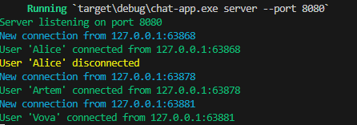
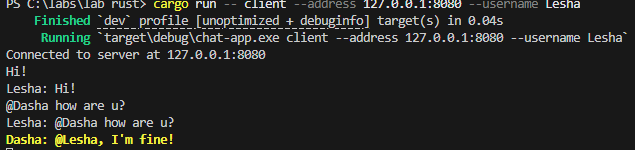
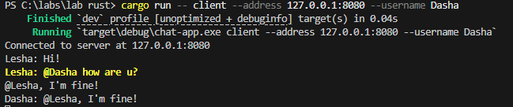

# Консольное приложение на Rust, реализующее клиент и сервер чата.

## Сборка

cargo build --release

## Использование

### Запуск сервера 

cargo run -- server --port 8080

### Запуск клиента

cargo run -- client --address 127.0.0.1:8080 --username Alice

## Особенности

- Сервер пересылает все сообщения всем подключенным клиентам
- Сообщения, адресованные пользователю (содержащие `@username`), подсвечиваются желтым цветом
- Каждый клиент отправляет свое имя пользователя при подключении
- Сообщения отображаются в формате `username: message`

## Пример использования

1. Запустите сервер в одном терминале:
   cargo run -- server --port 8080

2. Запустите первого клиента:
   cargo run -- client --address 127.0.0.1:8080 --username Alice

3. Запустите второго клиента в другом терминале:
   cargo run -- client --address 127.0.0.1:8080 --username Bob

4. Введите сообщения в любом из клиентов - они будут видны всем подключенным пользователям.

5. Чтобы отправить сообщение конкретному пользователю, включите `@username` в текст сообщения, например: `@Bob Привет!`

